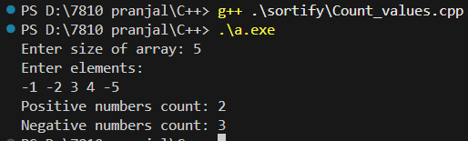
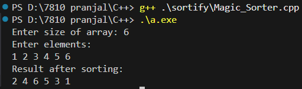
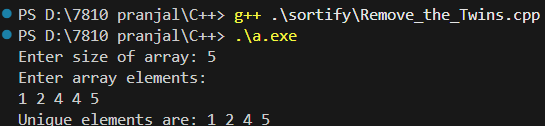
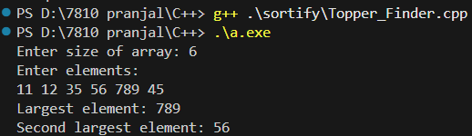

# sortify_DSA

## Output Screenshots

### Output 1 – Count Positive & Negative

### Output 2 – Magic Sorter

### Output 3 – Remove the Twins (Duplicates)

### Output 4 – Sort Squad (Even–Odd Sort)

### Output 5 – Topper Finder (Largest & Second Largest)

